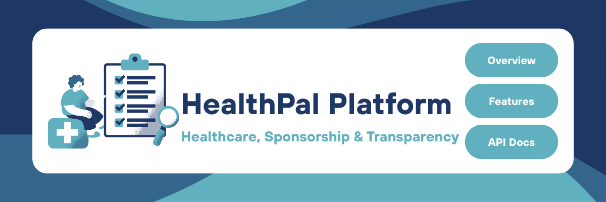

  <h1 align="center">🏥HealthPal – Digital Healthcare Platform</h1>
<p align="center">
  <a href="">▶️ View Demo</a>
  &nbsp;&nbsp;&nbsp;&nbsp;
  <a href="https://github.com/ShorouqDerieh/HealthPal/issues">🐞 Report Issue</a>
</p>
<p align="center">
  
</p>

<a id="about-the-project"></a>
## 📘 About the Project

HealthPal is a comprehensive digital healthcare platform designed to provide Palestinians with 
access to medical support, remote consultations, medicine coordination, and donation-driven 
treatment sponsorships.

 The app bridges patients, doctors, donors, and medical NGOs to help 
overcome the collapse or inaccessibility of local healthcare systems

<details>
  <summary><h2>📚 Table of Contents</h2></summary>
  <ul>
    <li><a href="#about-the-project">About the Project</a></li>
    <li><a href="#technologies-tools">Technologies & Tools</a></li>
    <li><a href="#getting-started">Getting Started</a></li>
    <li><a href="#main-features">Main Features</a></li>
    <li><a href="#additional-features">Additional Features</a></li>
    <li><a href="#external-apis">External APIs</a></li>
    <li><a href="#roles">Roles</a></li>
    <li><a href="#api-documentation">API Documentation</a></li>
    <li><a href="#demo">Demo</a></li>
    <li><a href="#contact">Contact</a></li>
  </ul>
</details>


<a id="technologies-tools"></a>
## 🛠 Technologies & Tools

- **Node.js** – JavaScript runtime used to build the backend server.
- **Express.js** – Web framework for creating RESTful APIs.
- **MySQL** – Relational database management system.
- **JWT (jsonwebtoken)** – Used for secure authentication and role-based access control.
- **bcryptjs** – Used to hash and protect user passwords.
- **Helmet** – Adds security-related HTTP headers to the application.
- **express-rate-limit** – Protects the API from brute-force and abuse attacks.
- **CORS** – Enables controlled cross-origin requests.
- **fastest-validator** – Used for request data validation.
- **body-parser** – Parses incoming request bodies.
- **Multer** – Handles file uploads such as medical documents and attachments.
- **node-cron** – Used to schedule background tasks and periodic jobs.
- **Nodemailer** – Used to send email notifications.
- **Axios** – Used for making HTTP requests to external services.
- **OpenAI API** – Supports AI-based features such as translation.
- **PayPal API** – Handles secure payment processing and transactions in USD.
- **YAML** – Used for defining OpenAPI specifications.
- **Postman** – Used to test, validate, and demonstrate API endpoints.
- **GitHub** – A web-based platform for version control and collaboration using Git.


<a id="getting-started"></a>
## 🚀 Getting Started
### ⚙️ Running the Project

### 1. Clone the Repository
First, clone the project repository from GitHub using the following command:

```bash
git clone https://github.com/ShorouqDerieh/HealthPal.git
```


### 2. Install Dependencies
Make sure Node.js and npm are installed on your system.  
Install the required dependencies by running:
```bash
npm install
```

### 3. Create the Database
Ensure that MySQL is installed and running on your local machine.  
Create a new database for the project:
```bash
CREATE DATABASE healthcare_db;
```

### 4. Configure Environment Variables
Create a `.env` file in the root directory of the project and add the following configuration:
```bash
PORT=3100  
DB_HOST=localhost  
DB_USER=your_mysql_username  
DB_PASSWORD=your_mysql_password  
DB_NAME=healthcare_db 
JWT_SECRET=your_jwt_secret  
```

### 5. Run the Application
Start the backend server using the following command:
```bash
npm start
```


<a id="main-features"></a>
## ⭐ Main Features

### Feature 1 – Remote Medical Consultations
Enables patients to book remote medical appointments with doctors based on available time slots. Doctors manage their availability, confirm or cancel appointments, and both parties can securely view their consultation history. This feature forms the core doctor–patient interaction in HealthPal.

---

### Feature 2 – Medical Sponsorship & Transparency
Provides a structured medical sponsorship system where doctors create verified treatments, donors fund campaigns, and NGOs manage disbursements. Patient profiles, recovery updates, and a transparency dashboard ensure accountability, trust, and clear visibility of how donations are used.

---

### Feature 3 – Medication & Equipment Coordination
Manages the full lifecycle of distributing critical medicines and medical equipment. Users submit requests, organizations list available inventory, matches are created, and volunteers handle deliveries. The system enforces strict status transitions, updates inventory automatically, and triggers shortage alerts when stock falls below thresholds.

---

### Feature 4 – Health Education & Public Health Alerts
Supports community health awareness through educational health guides, public health alerts, and webinars. Users can access localized guides, receive urgent alerts filtered by region and severity, track unread alerts, and manage notification preferences. Webinars provide structured health education sessions for the community.

---

### Feature 5 – Trauma Counseling & Psychological Support
Provides secure psychological support services including trauma counseling sessions, anonymous therapy chats, and support groups. Sensitive counseling notes are encrypted using AES-256-CBC, anonymous chats use automatic pseudonyms, and access is restricted to authorized participants to protect privacy.

---

### Feature 6 – NGO Network & Medical Missions
Manages verified NGOs, medical missions, and surgical campaigns. Organizations can be registered and updated, missions scheduled, patients registered for missions, and medical teams approve or reject participation. This feature enables coordinated medical efforts and outreach activities.

---
<a id="additional-features"></a>
## ➕ Additional Features
- Role-based access control (Patient, Doctor, Volunteer, NGO Staff, Admin)
- Secure file uploads for medical documents and delivery proof
- Email notifications for alerts, shortages, and system events
- Inventory shortage detection and alerting
- User notification preferences (language and delivery channel settings: email, SMS, or in-app)

---
<a id="external-apis"></a>
## 🔌 External APIs

- **OpenAI API** – Used for AI-powered medical text translation.
- **Daily API** – Used to automatically generate webinar meeting rooms when needed.
- **SMTP (Email Service)** – Used to send health alerts and shortage notifications.
- **PayPal API** – Handles secure payment processing and transactions.
<a id="roles"></a>
## 👥 Roles

- 🧍 **Patient**: Users who request medical services, medications, equipment, or psychological support.
- 🤝 **Volunteer**: Users who help fulfill medication and equipment delivery requests.
- 🏥 **NGO Staff**: Users who manage organizations, medical inventory, and approve or coordinate aid operations.
- 🧑‍⚕️ **Doctor / Counselor**: Healthcare professionals providing medical consultations, counseling sessions, and webinars.
- 🛡️ **Admin**: Users who manage the platform, monitor operations, and control system-wide settings and alerts.

<a id="api-documentation"></a>
## 📄 API Documentation

Access the complete API documentation for HealthPal here: 
🔗 **[HealthPal API – Postman Documentation](https://documenter.getpostman.com/view/49890896/2sB3dSRVE8)**

<a id="demo"></a>
## 🎬 Demo

- 🚀 [View Demo](https://drive.google.com/drive/folders/1dZ2h-5t3zk3Tjp6sT1Q9qH5brALmINRq?usp=drive_link) – Backend API demo via Postman

<a id="contact"></a>
## 📬 Contact

- 👩‍💻 **Shorouq Derieh** – shorouqderieh8@gmail.com
- 👩‍💻 **Afnan Hasan** – afnan1.alhasan@gmail.com
- 👩‍💻 **Hiba Banimeneh** – hiba.alzayed36@gmail.com


